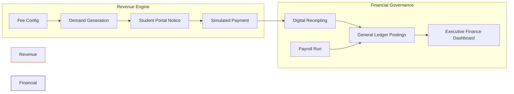

# CampusNexus ERP: The Unified Institutional Intelligence Platform
**Strategic Resource Planning & Governance for Multi-Campus Higher Education**

---

## 🏛️ Enterprise Vision
In an era of rapid digital transformation, **CampusNexus ERP** provides a robust, multi-campus aware ecosystem designed for large-scale institutions (10,000+ students). Developed as a client-ready, resellable SaaS platform, it harmonizes academic excellence with administrative precision.

> [!TIP]
> **Total Ecosystem Awareness**: Integrated RBAC and global campus switching ensure data integrity while providing localized operational autonomy.

---

## 🛠️ Strategic Solutions Architecture

### 1. Unified Student Lifecycle Management (SLM)
*Optimize the student journey from prospective applicant to distinguished alumni.*
- **Intelligent Admissions Funnel**: Automated lead scoring and conversion tracking (Applied → Verified → Offered → Confirmed).
- **Institutional SIS**: A 360° student intelligence profile (Academics, Attendance, Financials, Documents).
- **Automated Credentials**: Digital ID card generation and transcript management with one-click verification.

### 2. Academic Operations & Governance
*Eliminate administrative friction and focus on pedagogical success.*
- **Advanced Academic Structuring**: Manage complex mappings of Programs, Courses, and Sections across disparate campuses.
- **Visual Timetable Engine**: High-fidelity scheduling with integrated **Conflict Resolution Logic** (Room, Faculty, and Time clashes).
- **Compliance-Driven Attendance**: सब्जेक्ट-wise breakdown with automated shortage/defaulter alerts.

### 3. Financial Integrity & HR Governance
*Precision in auditing and workforce optimization.*
- **Multi-Campus Finance Hub**: Unified Income vs. Expense dashboards with automated ledger postings from Fees and Payroll.
- **Dynamic Fee Structures**: Campus-specific configurations with simulated payment settlement and aged debt reporting.
- **Strategic HRMS**: Full-cycle employee management, including leave governance and automated payroll register generation.

---

## 📈 Advanced Integrated Workflows

### A. The Institutional Success Continuum
The structural flow from high-level institutional setup to student delivery.

```mermaid
graph TD
    subgraph "Institutional Governance"
        Config[Global Configuration] --> CampusSwitch[Campus Switching & RBAC]
        CampusSwitch --> Modules[Module Provisioning]
    end

    subgraph "Academic Execution"
        Modules --> Adm[Admissions Funnel]
        Adm --> SIS[Student Onboarding]
        SIS --> TT[Timetable & Pedagogy]
        TT --> Ops[Daily Operations: Attendance/Marks]
    end

    subgraph "Audit & Completion"
        Ops --> Exams[Examination Lifecycle]
        Exams --> Results[Results & Transcripts]
        Results --> Reports[Institutional Analytics]
    end

    style Institutional Governance fill:#e1f5fe,stroke:#01579b
    style Academic Execution fill:#fff9c4,stroke:#fbc02d
    style Audit & Completion fill:#e8f5e9,stroke:#2e7d32
```

### B. The Unified Financial Cycle
How we automate the institutional revenue stream.



---

## 👥 Personas & Specialized Dashboards

| Workforce Persona | Platform Strategy | Operational Impact |
| :--- | :--- | :--- |
| **Executive Management** | **Analytics Hub** | Real-time KPI cards for enrollment, revenue, and compliance. |
| **Academic Faculty** | **Instructional Portal** | Marks entry, attendance marking, and cohort performance tracking. |
| **Registrar/Admissions** | **Admissions Desk** | Document verification, seat allocation, and applicant conversion. |
| **Financial Controller** | **Finance Suite** | Ledger reconciliation, vendor aging, and budget vs. actuals. |
| **Human Resources** | **Workforce Manager** | Shift management, payroll batching, and leave approvals. |
| **Students** | **Mobile Experience** | Frictionless payments, timetable access, and digital results. |

---

## 📊 Business Intelligence & Reporting Hub
CampusNexus ERP features a unified **Strategic Reports Hub** with multi-format export (PDF/Excel) for all modules.

- **Strategic Analytics**: Application funnels, seat occupancy metrics, and faculty workload utilization.
- **Operational Compliance**: Daily attendance summaries, grade distribution, and backlog analysis.
- **Financial Intelligence**: Dues aging, collection summaries, and monthly finance packs.

---

## 🚀 Performance & Technical Integrity
- **High-Concurrency Ready**: Optimized for 10,000+ student data points with paginated low-latency rendering.
- **Security First**: Role-Based Access Control (RBAC) ensuring data siloing between departments.
- **Audit-Ready UI**: Status history tracking for all sensitive records (Marks, Admissions, Finance).

---
**Institutional Excellence via CampusNexus ERP**
*Version 1.0 | Prepared by Daneen Al Majaz IT Services*
